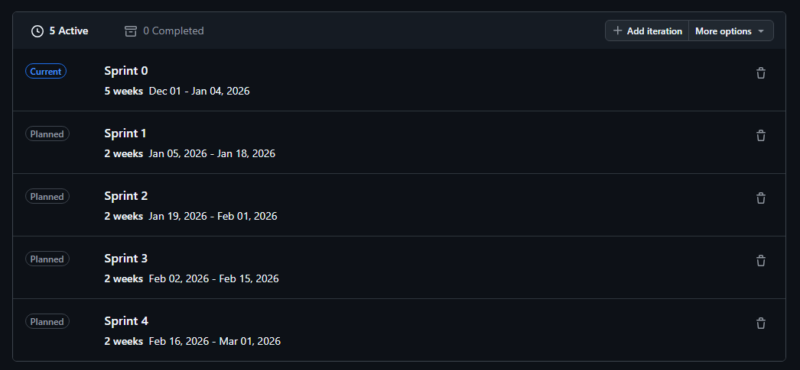

# Roadmap

## Time Plan

## Overview Hardware
| Sprint | Todo | Check | Due |
|--------|------|-------|-----|
|0|Setup Architecture|Completed|04.01.26|
|0|Find Sponsors|Completed|04.01.26|
|1|Get Hardware|Completed|18.01.26|
|2|Create Initial Prototypes|Completed|30.01.26 |
|3|Create Secondary Prototypes|In Progress|15.02.26 |
|4|Test Prototypes|To Do|01.03.26|
|4|Refine Prototypes|To Do|01.03.26|
|4|Test Prototypes|To Do|01.03.26|

## Overview Software 

| Sprint | Todo | Check | Due |
|--------|------|-------|-----|
|0|Setup Architecture|Completed|04.01.26|
|1|Build initial App|Completed|18.01.26|
|2|Build IoT Platform|Completed|30.01.26|
|3,4|Implement Google Maps SDk and Map|In Progress|01.03.26|
|3,4|Build Settings Logic|In Progress|01.03.26
|3,4|Build Frontend|In Progress|01.03.26|
|4|Upload to Google Playstore|To Do|01.03.26|